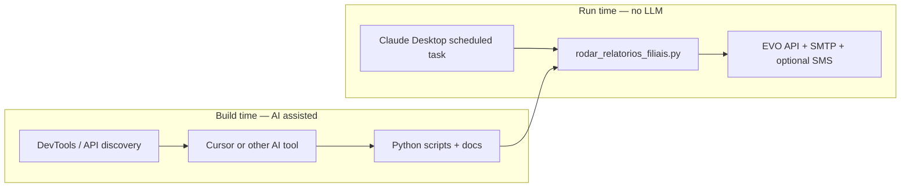

My wife manages sales at a gym chain that runs on EVO (W12). Every morning she needs per-employee numbers from the day before — yesterday's close, month-to-date, contribution share, goal progress — for each branch she oversees. The data lives behind a login, spread across legacy screens, and the manual export path is slow enough that "I'll do it later" becomes "we're flying blind until noon."

This post is not about LangChain or agents in the loop. It is about the opposite pattern: **use AI while you are building the automation, then run deterministic Python on a schedule** so daily token spend stays near zero.

The code lives in [`relatorio_vendas`](https://github.com/ndanilo/relatorio_vendas) on GitHub.

## The split: build time vs run time

Most "AI automation" demos show the model doing the work every day — logging in, clicking, summarizing. That works for a proof of concept. It is a poor fit for a job that must fire at 7 a.m. whether or not someone is at the keyboard.

I split the problem in two:



**Build time** is where the intelligence goes: reverse-engineering the HTTP flow EVO uses in the browser, shaping configuration for multiple branches and employees, hardening date filters and email layout, writing docs and scheduler prompts. Cursor (and other AI tools) helped on the granular tasks — parsing responses, iterating on edge cases, keeping the repo documented.

**Run time** is boring on purpose. One orchestrator command, no model call, no reasoning about what "yesterday" means. The scheduled agent is a **runner**, not a co-worker.

## What build-time AI actually produced

The useful output was not chat transcripts. It was **artifacts**:

1. **Scripts that replay the browser flow with stdlib HTTP** — login, branch context, `listarVendas` with the same filters a human would pick on the sales screen. No Playwright at runtime; see [`docs/en/flow.md`](https://github.com/ndanilo/relatorio_vendas/blob/master/docs/en/flow.md) for the full sequence.
2. **`evo_config.json`** — branches, employee IDs, optional monthly goals, SMTP and SMS settings. Copied from `evo_config.example.json`, filled once on the runner, never committed.
3. **Email HTML with charts that survive clients** — contribution donut as SVG shapes only (no `<text>` inside SVG), bars and labels as plain HTML tables.

   Basic sample (synthetic branch data, no EVO login):

   

4. **Orchestration docs** — run all branches with error isolation, exit codes, and a scheduled-task prompt for Claude Desktop.

That is a one-time (or occasional) investment. When EVO changes an endpoint or a branch adds staff, you edit config or patch the script — you do not re-prompt a model every morning.

## What run time looks like

The entry point for automation is the orchestrator:

```powershell
py rodar_relatorios_filiais.py
```

For each branch in config it fetches yesterday and month-to-yesterday sales, writes `.txt` and `.csv` under `relatorios/`, and sends one HTML email per branch. After the batch, an optional SMS summary goes out via Brevo.

If one branch fails, the orchestrator logs the error and continues with the rest — then exits `1` so the scheduled run can be flagged.

## Why token cost stays low

Compare two designs:

| Approach | Daily cost | Failure mode |
|----------|------------|--------------|
| Ask Claude to log into EVO and build the report each morning | High — full session, tool use, retries | Non-deterministic; hard to test |
| Fixed prompt → run `rodar_relatorios_filiais.py` → report status | Low — short instruction, no generation | Script either exits 0 or 1 |


The scheduled task is a **runner**: fixed steps, local repo path, one orchestrator command. Prompt details live in [`docs/en/claude-desktop-automation.md`](https://github.com/ndanilo/relatorio_vendas/blob/master/docs/en/claude-desktop-automation.md).

All the "thinking" — date rules, API payloads, chart layout — already lives in Python. The scheduler only executes and reports status.

## Design decisions that make unattended runs possible

Three basics that matter for a daily cron-style job:

- **Stdlib-only runtime** — no `pip install` on the runner; charts are inline SVG + HTML tables.
- **Per-branch isolation** — one subprocess per branch; a failure in unit A does not block unit B.
- **Secrets outside git** — `evo_config.json` stays local; the scheduler prompt forbids inventing credentials.

## Honest caveat: prompts lag code

The Claude Desktop prompt in the repo still mentions `matplotlib` from an older chart approach. This project uses inline SVG instead. Update scheduler instructions when the code changes — the screenshot above shows a real setup still being iterated on.

## Common mistakes

- **Using the model as the integration layer every day** — build once with AI, run scripts on a schedule.
- **Shipping secrets in the repo** — config templates yes, real credentials no.
- **Letting scheduler prompts go stale** — the matplotlib mismatch in my own setup is the example.

## Key takeaway

The best daily automations **compile intelligence into code** and treat the scheduler as a dumb, reliable executor. AI helped me discover the EVO flow, shape the scripts, and document the ops path. What runs every morning is Python, exit codes, and a short status message — not a fresh reasoning session.

That is how my wife gets branch-level sales reports in the inbox before the floor opens, without paying for yesterday's discovery work again today.
